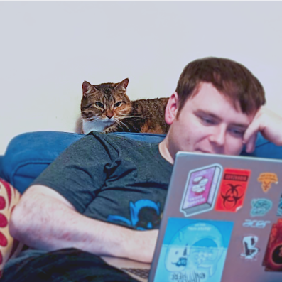

<html>
  

  <body>
    

      

        
      

      

        <h1>I'm Luke</h1>I used to design robots; now I'm doing a PhD in machine vision. I use this website to collect research papers I've read and loved, and to journal my ideas.
        
        All posts are listed bellow in chronological order.
      

    

  </body>
</html>